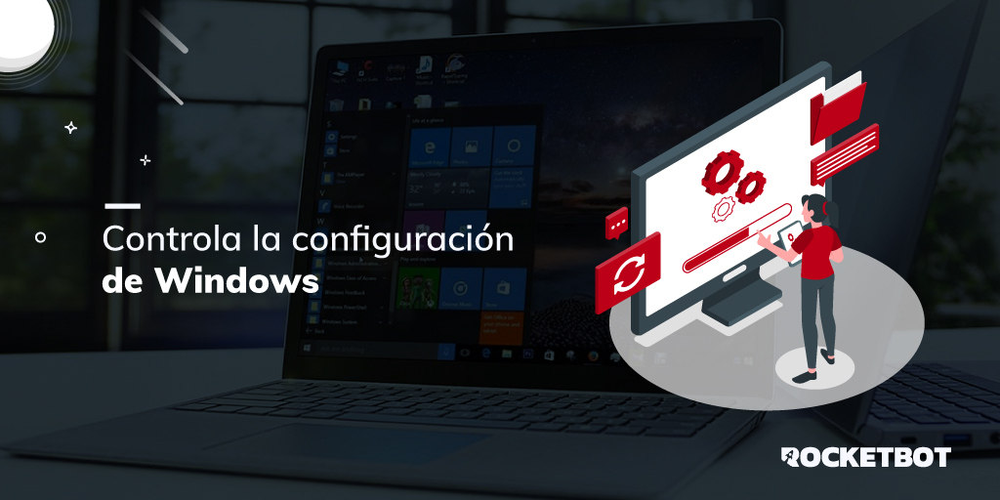

# Windows
  
Working with Windows configuration  
  

## Como instalar este módulo
  
__Descarga__ e __instala__ el contenido en la carpeta 'modules' en la ruta de rocketbot.  

## Descripción de los comandos

### Obtener resolución de pantalla
  
Retorna la resolución actual de la pantalla
|Parámetros|Descripción|ejemplo|
| --- | --- | --- |
|Asignar resultado a variable|Nombre de la variable a la que se asignará el resultado|Variable|

### Obtener todas las resoluciones

Retorna todas las resoluciones de la pantalla permitidas
|Parámetros|Descripción|ejemplo|
| --- | --- | --- |
|Asignar resultado a variable|Nombre de la variable a la que se asignará el resultado|Variable|

### Cambiar resolución
  
Modifica la resolución de pantalla
|Parámetros|Descripción|ejemplo|
| --- | --- | --- |
|Resolución|Resolución de pantalla|800,600|

### Obtener nombre de usuario
  
Retorna el nombre de usuario actual
|Parámetros|Descripción|ejemplo|
| --- | --- | --- |
|Asignar resultado a variable|Nombre de la variable|Variable|

### Bloquear pantalla 
  
Bloquea la pantalla de Windows
|Parámetros|Descripción|ejemplo|
| --- | --- | --- |

### Estoy logeado?
  
Verifica si el usuario actual esta logeado y no esta bloqueada la pantalla
|Parámetros|Descripción|ejemplo|
| --- | --- | --- |
|Asignar resultado a variable||Variable|

### Maximizar ventana
  
Maximiza una ventana
|Parámetros|Descripción|ejemplo|
| --- | --- | --- |
|Title||Titulo de la ventana|

### Restaurar ventana
  
Restaura una ventana
|Parámetros|Descripción|ejemplo|
| --- | --- | --- |
|Title||Titulo de la ventana|

### Minimizar ventana
  
Minimiza una ventana
|Parámetros|Descripción|ejemplo|
| --- | --- | --- |
|Title||Titulo de la ventana|

### Listar ventanas abiertas
  
Lista las ventanas abiertas
|Parámetros|Descripción|ejemplo|
| --- | --- | --- |
|Guardar en||Variable|
|Desea los handles?||Checkbox|
|Filtro||Palabra a buscar|

### Traer ventana al frente
  
Trae una ventana al frente
|Parámetros|Descripción|ejemplo|
| --- | --- | --- |
|Title||Titulo de la ventana|
|Maximizar||Checkbox|

### Buscar ventana
  
Busca una ventana por titulo
|Parámetros|Descripción|ejemplo|
| --- | --- | --- |
|Title||Titulo de la ventana|
|Asignar resultado a variable||Variable|

### Obtener estado servicio
  
Obtener el estado de un servicio
|Parámetros|Descripción|ejemplo|
| --- | --- | --- |
|Title||Titulo del servicio|
|Asignar resultado a variable||Variable|

### Iniciar servicio
  
Inicia un servicio
|Parámetros|Descripción|ejemplo|
| --- | --- | --- |
|Title||Titulo del servicio|
|Asignar resultado a variable||Variable|

### Parar servicio
  
Para un servicio
|Parámetros|Descripción|ejemplo|
| --- | --- | --- |
|Title||Titulo del servicio|
|Asignar resultado a variable||Variable|

### Mover y redimensionar ventana
  
Cambia la posición y dimensiones de una ventana obtenida por título
|Parámetros|Descripción|ejemplo|
| --- | --- | --- |
|Title||Titulo del servicio|
|Coordenadas (x, y)||0,0|
|Dimensiones (Ancho, Alto)||0,0|
